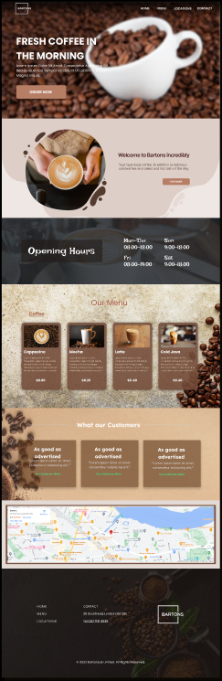
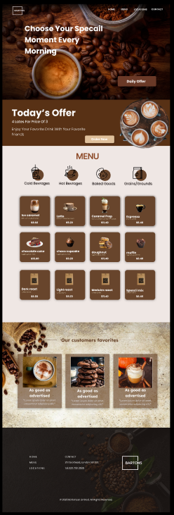
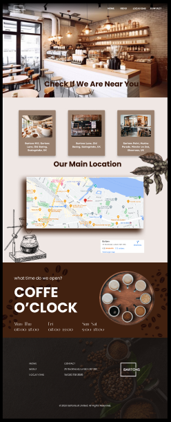
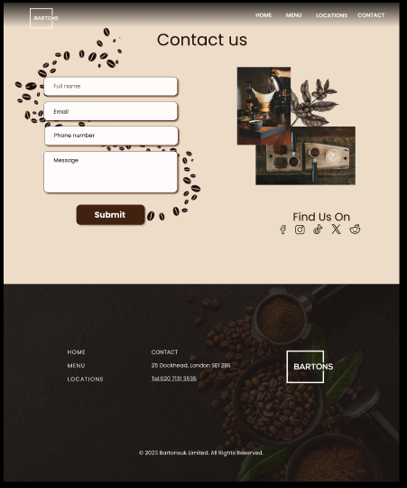

# Bartons - Café Website

Bartons is a professionally designed static website for a coffee shop, featuring four distinct pages:

*Home Page*: The home page serves as the landing page, offering a brief introduction to the café, its operating hours, and a quick overview of the menu.

*Menu Page*: Here, you'll find a detailed menu with item descriptions, prices, and the ability to place orders. Additionally, the menu highlights the café's favorite items.

*Location Page*: This page provides a comprehensive listing of all café branches, complete with precise location information displayed on an interactive map.

*Contact Page*: The contact page offers customers the opportunity to get in touch with the café for inquiries, feedback, or suggestions to enhance their experience.

## Figma Design

### Mockups
      

## Figma link 
- [Figma Link](https://www.figma.com/file/cF7aZ2O1Qfkvif8XRqEt8j/O'coffee?type=design&node-id=140%3A70&mode=design&t=lJmOMSuwMDy0AeDh-1)

## Demo

https://ayaelrhayour.github.io/brief_2/

## Presentation

- [Presentation Link](https://www.canva.com/design/DAFxKX-_o5g/Rhx6IlwatamHAqCl9CqWzA/edit?utm_content=DAFxKX-_o5g&utm_campaign=designshare&utm_medium=link2&utm_source=sharebutton)
## Trello

- [Trello Link](https://trello.com/b/H3ttqDNq/bartone-brief2)

## Tech Stack

*Client:* HTML, CSS

## Author

- [Aya Elrhayour](https://github.com/AyaElrhayour)

## Feedback

For any feedback or inquiries, please don't hesitate to contact me at ayaelrhayour123@gmail.com. Your input is greatly appreciated!